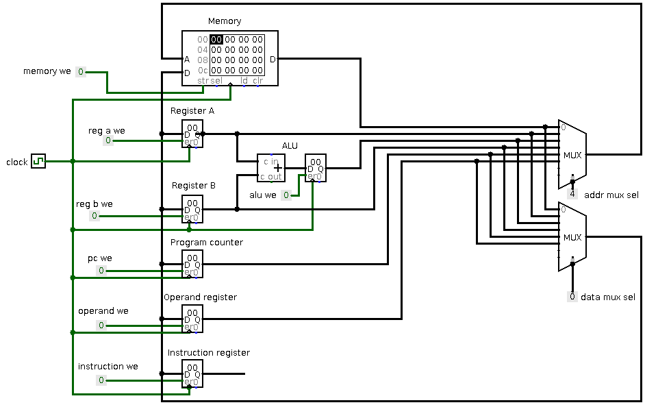
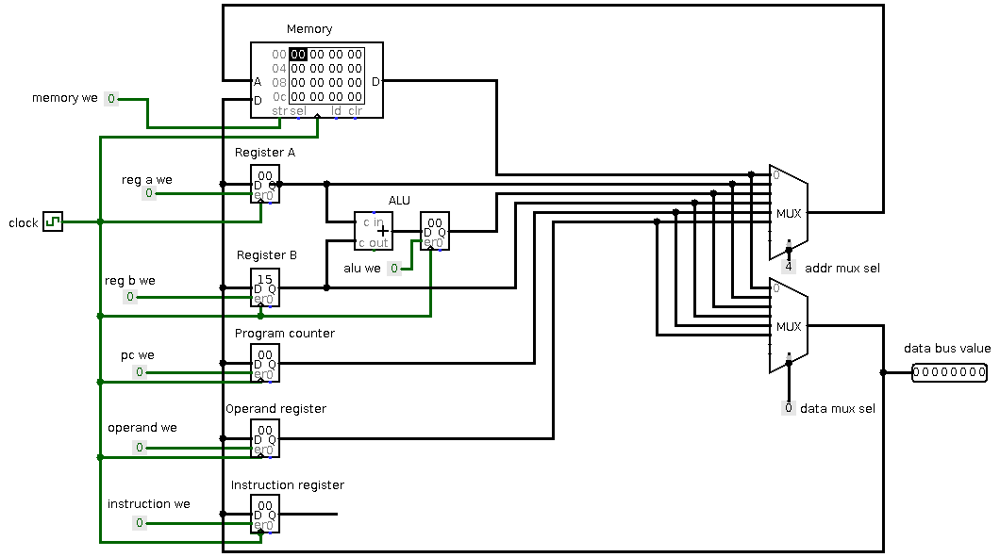
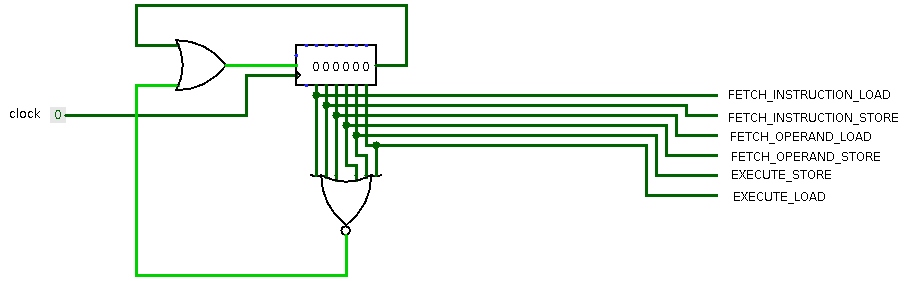
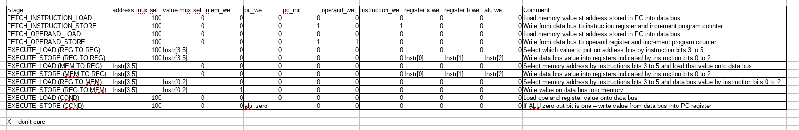
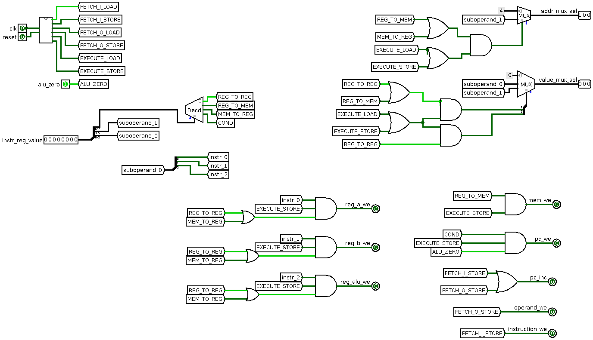
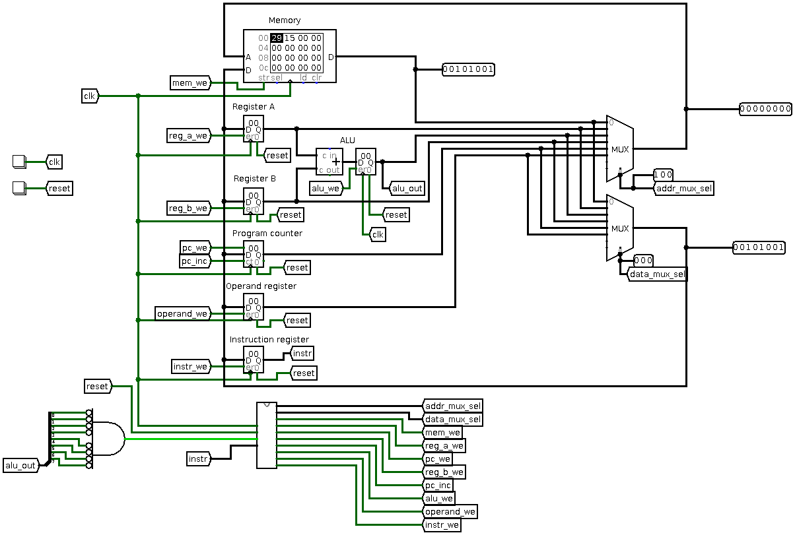

# Shitty CPU

Some time ago, I participated in a [CTF](https://ctftime.org/event/994) and one [task](https://ctftime.org/task/11578) peeked my curiosity like no other.

This task was created in memory of John Conway for his research on [game of life](https://en.wikipedia.org/wiki/Conway%27s_Game_of_Life).
As it turns out, game of life is turing complete and CTF organizers created a small CPU which runs completely in game of life.

This CPU is made of so many cells, that just scrolling to see individual cells takes some time:


This peeked my curiosity enough that I decided to design my own simple CPU in order to better understand how CPU's work under the hood.

## Idea

For my purposes I need something as simple as it gets.
So do not expect anything fancy like pipelines, interrupts, fancy maths or whatever...

The need for simplicity basically dictated [von Neumann](https://en.wikipedia.org/wiki/Von_Neumann_architecture) architecture.
Also in order to be able to do any kind of maths the minimum amount of registers required was two - and thus, A and B registers were born.
The "maths" I am talking about here is just a simple addition of those two registers.
Obviously because this is two's complement addition, just adding negated number will give us subtraction for free.
For simplicitly I decided to ditch logic operations.

To be turing complete - I will also need some conditional branching, so basically jumps to some address only if the result of addition is zero.

Because I will try to write at least one real program for this CPU (aka blink some LEDs), it would be quite nice to be able to address memory directly "inside" instructions.
In the end this "requirement" ended up somewhat complicating CPU design, but, as a result, the instruction set became much more flexible.

Oh and of course - this is an 8 bit CPU.
Why whould you choose anything else in this scenario?

At first I thought that it would be nice to find some logic simulators and build the whole CPU out of logic elements by manually connecting them.
But after some reading, it felt like [HDLs](https://en.wikipedia.org/wiki/Hardware_description_language) are a natural fit for this.
Even though those operate at a bit "higher-level".

I chose VHDL completely arbitrary, no preference for this over the other languages.

## Components

It turns out, that (simple) CPUs do not require that many components after all.
In this CPU there basically is:
* A few Multiplexers
* Some registers
* Some counters
* ALU
* Memory
* Controller

### Multiplexer

Well this is a simple component which "connects" single output to some number of inputs.
Input selection is controlled by the binary value of selection signals.


In this example there are four inputs, one output and consequently - two selection signals.

This is a truth table ("sort of"):

|sel2|sel1|  output  |
|----|----|----------|
| L  | L  |out == in1|
| L  | H  |out == in2|
| H  | L  |out == in3|
| H  | H  |out == in4|

This is an example 1 bit multiplexer out of pure logic elements:


If we would like to build a multiplexer with wider inputs than one bit - we can simply copy this circuit multiple times.
All respective selection pins from separate 1 bit muxes should be connected together and inputs to separate 1 bit muxes represent separate bits of input.


For our 8 bit CPU's we will be using a [multiplexer](mux.vhdl) with 8 selectable inputs (and 4 selector signals) each of which is 8 bits wide.


### Register

Register is basically a small memory built from logic components (think expensive memory :D).

This CPU will be using so called "synchronized" registers, meaning that it will set its value only on rising clock edge.
So our register should have:
* data input
* clock input
* write enable input
* output

So basically I would like a "memory" which remembers input value when clock is on the rising edge and write enable input is high.
And output should always represent the "remembered" value.

This is how we can achieve this for single bit:


This is called D-flip flop.

Again wider register can be achieved by connecting "control" (clock, write enable) inputs together for multiple flip flops and by connecting data inputs for separate bits to separate flip flops data inputs.


### Counter

Counter is basically a register, but it additionally has increment signal.
Value stored in the register is incremented on each rising edge of the increment signal.

This component is extremely useful to hold Program Counter value, and to increment it once instruction is fetched :).

This is a version of a 2-bit counter with two J-K flip flops:


### ALU

In this case ALU is perfoming only only one operation - adding numbers.
So it is probably better to call it adder ¯\\_(ツ)_/¯, but oh well...
ALU sounds fancier.

As mentioned before we would like to have conditional jumps, therefore we will need to output some kind of signal indicating whether or not the jump should be taken.
For this CPU that signal will indicate if the sum is zero.
Other than that the ALU is simple adder.

Lets start with adding two bits (a and b) together:

|bit a|bit b|  output  |
|---- |---- |----------|
| L   | L   |     L    |
| H   | L   |     H    |
| L   | H   |     H    |
| H   | H   |     L    |

Note: that summing 1 and 1 together produces zero, as it "wraps around".

The truth table above is just a XOR gate.
This would be enough in order to add two bits together, but we would like to be able to chain these adders in order to add larger numbers (e.g. 8bit).
In order to achieve this we will be adding three bits together instead of two, and also we will be outputing additional carry signal.

|bit a|bit b|carry in| carry out |  output  |
|---- |---- |  ----  | --------- |----------|
|  L  |  L  |    L   |     L     |     L    |
|  H  |  L  |    L   |     L     |     H    |
|  L  |  H  |    L   |     L     |     H    |
|  H  |  H  |    L   |     H     |     L    |
|  L  |  L  |    H   |     L     |     H    |
|  H  |  L  |    H   |     H     |     L    |
|  L  |  H  |    H   |     H     |     L    |
|  H  |  H  |    H   |     H     |     H    |

We can achieve this with this schematic:


And chaining them together:


### Memory

For memory I will not be going into details.
I will just describe how to use it and will leave it as a black box.

Naturally we need some way to tell it when to write and when to read.
This will be determined by a write enable signal.
When write enable signal is low - memory will be reading.
When write enable signal is high - memory will be writing.

Reading and writing will always be happening on rising clock edge.

And, obviously, address bus will select the address where to read or write.

When writing - data will be "taken" from data input bus, and when reading - data will be "put" on data output bus.


---

By now, only the controller is left.
But I believe that it is easier to understand what it does and how it achieves what it needs after there is some idea how the rest of the components will be connected together.

Therefore I will leave it for later stage.

## Architecture

Now that we have our components, lets look how we could connect them together (as mentioned before, I will be leaving out the controller for now).

We know that we would like to have two registers: A and B.
We know that we would like to have accumulator register to store ALU result.
Our instruction set (see [instruction set](#instruction_set)) does require operand register.
Obivously we need instruction register.

Keeping all that in mind, this is what I came up with:


The idea here is that we do have two multiplexers, one for selecting address at memory and the other for selecting "data bus" value.
Input to both multiplexers are all of the registers/counters/memory outputs.
So basically we can select any register/counter/etc for either address or data bus via multiplexer select signal.
Now the output of the address multiplexer is directly connected to the address bus of the memory.
So by manipulating selection bits of that multiplexer - we can select the source for the address in memory (be it a PC register, ALU accumulator register or just simply register A).

The data bus is a bit more interesting.
Output of all of the registers are inputs to the data bus multiplexer, just like the address bus.
But the output of the data multiplexer is connected to the inputs of all the various register/counters/memory/etc.
This forms some kind of loop.

Lets simulate what would controller do in order to execute some simple instruction.
For example: `MOV A, B` (e.g. copy value of register B to register A).

So for that we would like to:
- 1. On the first clock, we select data multiplexer to output the value of the register B onto the bus
- 2. On the second clock, we set register A write enable signal to high



By this point it should be much clearer that the job of the contoller is basically to manipulate various control signals in the CPU in order to achieve the results.
But again before drawing the controller - lets define our instruction set.

## Instruction set

Lets define our instruction set in order to be able to create controller for our CPU and write some programs.

So I would like to address memory directly from instructions, or move constants directly into registers, but, unfortunately, I cannot fit full byte for constant value and the opcode into single byte.
So I decided to make all instructions two bytes.
First byte encodes the instruction itself and the second one - operand value.
Note that not all instruction uses that operand value, which wastes a little bit of memory, but always having this byte is just simpler compared to conditionally fetching operand from memory according to instruction.

```
0        8        16
+--------+--------+
| Opcode |Operand |
+--------+--------+
```

Operand is just a arbitrary 8bit value available during instruction execution.

Opcode on the other has some structure to itself.
I decided to divide those 8bits of the opcode like this:
* 3 LSB bits for selection of of first suboperand (S1)
* 3 middle bits for selection of second suboperand (S2)
* 2 MSB bits for selection of instruction type (there will be four instruction types) (T)

```
+---+---+--+
|S1 |S2 |T |
+---+---+--+
```

The mentioned four instruction types are:
* Register to register - Moves data between registers (or ALU and accumulator register) (T value of 00)
* Register to memory - Moves data from some register to memory (T value of 01)
* Memory to register - Moves data from memory to some register (T value of 10)
* Conditional - well the only conditional instruction supported by this CPU is JZ (jump if accumulator register value is zero) (T value of 11)

S1 and S2 suboperands semantics differ according to instruction type, therefore I will list them separately:

### Register to register

For register to register instructions, type value T is equal to `00`.

The second suboperand selects source register like this:
* `000` - register a
* `001` - register b
* `010` - ALU accumulator
* `011` - operand byte from instruction
* `100` - program counter
* `101` - memory
* `110` - unused
* `111` - unused

The first suboperand S1 selects destination register like this:
* `000` - register a
* `001` - register b
* `010` - acc register (aka performs addition)
* `100` - program counter register

Examples:
```
MOV A, B        00001000 00000000
ADD             00000010 00000000# Note: when writing into accumulator register, source register does not matter
MOV B, 0x15     00011001 00010101
JMP 0x15        00100011 00010101
```

### Register to memory

For register to memory instructions type value T is equal to `01`.

suboperand S1 selects data source for memory write.
suboperand S2 selects address source for memory write.

suboperand meaning and values matches the one from register to register selection:
* `000` - register a
* `001` - register b
* `010` - ALU accumulator
* `011` - operand byte from instruction
* `100` - program counter
* `101` - memory
* `110` - unused
* `111` - unused

Examples:
```
MOV [0x15], B   01011001 00010101
MOV [A], B      01000001 00000000
```

### Memory to register

For memory to register instructions type value T is equal to `10`.

suboperand S1 selects destination register for data write.
* `000` - register a
* `001` - register b
* `010` - acc register (aka performs addition)
* `100` - program counter register


suboperand S2 selects address value source for memory.
suboperand meaning and values matches the one from register to register selection:
* `000` - register a
* `001` - register b
* `010` - ALU accumulator
* `011` - operand byte from instruction
* `100` - program counter
* `101` - memory
* `110` - unused
* `111` - unused

Examples:
```
MOV B, [0x15]   10011001 00010101
MOV B, [A]      10000001 00000000
JMP [0x15]      10011100 00010101
```

### Conditional

For conditional instructions type value is equal to `11`.

All other bits are ignored therefore can be set to anything else.

Examples:
```
JZ              11000000 00000000
```

## Controller

Now finally we have all the pieces required to start talking about the controller: the last part of our CPU.

### Sequence generator

Ok I lied, we still need a seqence generator, but its a simple one, and I consider it to be part of the controller.

As we have seen [before](#architecture), execution of instruction is basically a two step process.
First we need to put "the data" onto the bus.
And secondly - we need to write the results somewhere.

So each instruction will be executed in two steps:
* load - during this stage, data is loaded onto data bus
* store - during this stage, data is read from the data bus

But wait! We need to know what instruction are we executing currently.
And looking back at the our ISA - we need (sometimes) to know our operand byte.
Therefore in order to execute one instruction we will have to:
* Fetch instruction byte from memory
* Fetch opcode byte from memory
* Execute the instruction

Therefore combining the above two, we get these stages:
1. load instruction byte onto data bus
1. store instruction byte into instruction register from data bus
1. load operand byte onto data bus
1. store operand byte into operand register from data bus
1. load whatever data is required by the instruction onto data bus
1. store data wherever required by the instruction

For this we will build a small shift register which will have a signal for each of the stages, and will "shift" the stage on every rising edge of the clock signal:



This way we will have a signal indicating which stage we are at.

### Mapping controller inputs and outputs

The controller takes instruction byte, alu zero out as its input signals (I am excluding obvious ones like reset and clock).
It internally generates sequence signals :).
Therefore we now only need to just map the input signals (including sequence signals) to the output signals:



Note that I have separated execution by instruction type.
But we already have "signals" for instruction type because we just mapped two MSB bits in the instruction itself to designate instruction type.

Therefore using some combinatorial logic, we get this masterpiece:


Here we just "replicated" the above table with the logic elements.

This is how single NOP (MOV A, A) instruction looks like "inside" the controller itself:




So lets connect our full CPU:


Here we just connected all the controll signals to the corresponding outputs of the controller and created alu zero signal with very wide AND gate with all the inputs inverted.

So lets execute some instructions :). This is how `MOV A, 0x15` would look like:



## Program

One of my goals was to write a LED blinker on a real FPGA, so I wrote this program:

```
# Configure GPIO into output mode
0b00011000, 0xFF,   # 0: MOVE A, 0xFF
0b10011000, 0xFC,   # 2: MOVE [0xFC], A

# Initialize our index counter
0b00011000, 0x08,   # 4: MOVE A, 0x08
0b00011001, 39,     # 6: MOVE B, 39

# Output value from memory into GPIO
0b00000010, 0x00,   # 8: ADD
0b01010001, 0x00,   # 10: MOVE B, [ALU]
0b10011001, 0xFD,   # 12: MOVE [0xFD], B

# Decrement index counter
0b00011001, 0xFF,   # 14: MOVE B, 0xFF
0b00000010, 0x00,   # 16: ADD
0b00010000, 0x00,   # 18: MOVE A, ALU
0b11000000, 0x00,   # 20: JZ 0x00

# Wait a little
0b10011000, 0x80,   # 22: MOVE [0x80], A
0b00011000, 0x14,   # 24: MOVE A, 0x0A
0b00011001, 0xFF,   # 26: MOVE B, 0xFF
0b00000010, 0x00,   # 28: ADD
0b00010000, 0x00,   # 30: MOVE A, ALU
0b11000000, 36,     # 32: JZ 36
0b00011100, 28,     # 34: J 28
0b01011000, 0x80,   # 36: MOVE A, [0x80]

# continue cycle
0b00011100, 6,      # 38: J 6

# GPIO data:
0x80,
0x40,
0x20,
0x10,
0x08,
0x04,
0x02,
0x01
```

For this program to work, I mapped GPIO pins with the LEDs connected to the highest address bits of the address bus.
It is somewhat like memory mapped GPIO.

And finally... The CPU ran on the FPGA itself:

