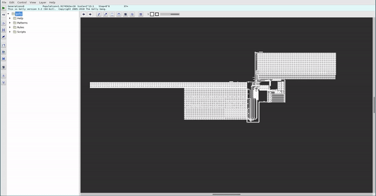

# Shitty CPU

Some time ago, I participated in one [CTF](https://ctftime.org/event/994) and one [task](https://ctftime.org/task/11578) peeked my curiosity like no other.

This task was created in memory of John Conway for his research on [game of life](https://en.wikipedia.org/wiki/Conway%27s_Game_of_Life).
As it turns out, game of life is turing complete and CTF organizers created a small CPU which runs completely in game of life.

This CPU is made of so much cells, that just to scroll to see individual cells takes some time:

This peeked my curiosity enough that I decided to design my own simple CPU in order to better understand how CPU's work under the hood.

