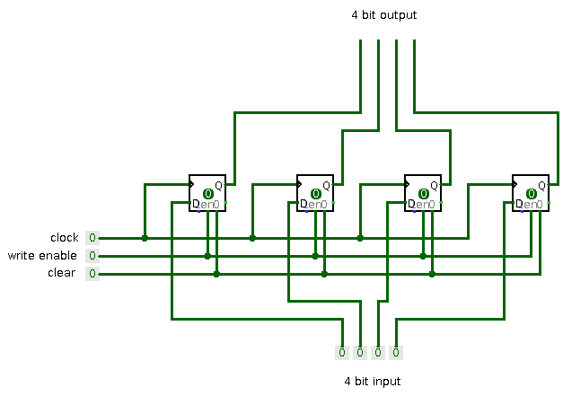
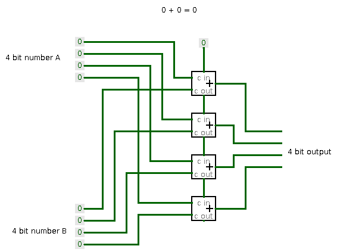

# Shitty CPU

Some time ago, I participated in a [CTF](https://ctftime.org/event/994) and one [task](https://ctftime.org/task/11578) peeked my curiosity like no other.

This task was created in memory of John Conway for his research on [game of life](https://en.wikipedia.org/wiki/Conway%27s_Game_of_Life).
As it turns out, game of life is turing complete and CTF organizers created a small CPU which runs completely in game of life.

This CPU is made of so many cells, that just scrolling to see individual cells takes some time:

This peeked my curiosity enough that I decided to design my own simple CPU in order to better understand how CPU's work under the hood.

## Idea

For my purposes I need something as simple as it gets.
So do not expect anything fancy like pipelines, interrupts, fancy maths or whatever...

The need for simplicity basically dictated [von Neumann](https://en.wikipedia.org/wiki/Von_Neumann_architecture) architecture.
Also in order to be able to do any kind of maths the minimum amount of registers required was two - and thus, A and B registers were born.
The "maths" I am talking about here is just a simple addition of those two registers.
Obviously because this is two's complement addition, just adding negated number will give us subtraction for free.
For simplicitly I decided to ditch logic operations.

To be turing complete - I will also need some conditional branching, so basically jumps to some address only if the result of addition is zero.

Because I will try to write at least one real program for this CPU (aka blink some LEDs), it would be quite nice to be able to address memory directly "inside" instructions.
In the end this "requirement" ended up somewhat complicating CPU design, but, as a result, the instruction set became much more flexible.

Oh and of course - this is an 8 bit CPU.
Why whould you choose anything else in this scenario?

At first I thought that it would be nice to find some logic simulators and build the whole CPU out of logic elements by manually connecting them.
But after some reading, it felt like [HDLs](https://en.wikipedia.org/wiki/Hardware_description_language) are a natural fit for this.
Even though those operate at a bit "higher-level".

I chose VHDL completely arbitrary, no preference for this over the other languages.

## Components

It turns out, that (simple) CPUs do not require that many components after all.
In this CPU there basically is:
* A few Multiplexers
* Some registers
* Some counters
* ALU
* Memory
* Controller

### Multiplexer

Well this is a simple component which "connects" single output to some number of inputs.
Input selection is controlled by the binary value of selection signals.

In this example there are four inputs, one output and consequently - two selection signals.

This is a truth table ("sort of"):

|sel2|sel1|  output  |
|----|----|----------|
| L  | L  |out == in1|
| L  | H  |out == in2|
| H  | L  |out == in3|
| H  | H  |out == in4|

This is an example 1 bit multiplexer out of pure logic elements:

If we would like to build a multiplexer with wider inputs than one bit - we can simply copy this circuit multiple times.
All respective selection pins from separate 1 bit muxes should be connected together and inputs to separate 1 bit muxes represent separate bits of input.

For our 8 bit CPU's we will be using a [multiplexer](mux.vhdl) with 8 selectable inputs (and 4 selector signals) each of which is 8 bits wide.

### Register

Register is basically a small memory built from logic components (think expensive memory :D).

This CPU will be using so called "synchronized" registers, meaning that it will set its value only on rising clock edge.
So our register should have:
* data input
* clock input
* write enable input
* output

So basically I would like a "memory" which remembers input value when clock is on the rising edge and write enable input is high.
And output should always represent the "remembered" value.

This is how we can achieve this for single bit:

This is called D-flip flop.

Again wider register can be achieved by connecting "control" (clock, write enable) inputs together for multiple flip flops and by connecting data inputs for separate bits to separate flip flops data inputs.

### Counter

Counter is basically a register, but it additionally has increment signal.
Value stored in the register is incremented on each rising edge of the increment signal.

This components is extremely useful to hold Program Counter value, and to increment it once instruction is fetched :).

This is a version of a 2-bit counter with two J-K flip flops:

### ALU

In this case ALU is perfoming only only one operation - adding numbers.
So it is probably better to call it adder ¯\\_(ツ)_/¯, but oh well...
ALU sounds fancier.

As mentioned before we would like to have conditional jumps, therefore we will need to output some kind of signal indicating whether or not the jump should be taken.
For this CPU that signal will indicate if the sum is zero.
Other than that the ALU is simple adder.

Lets start with adding two bits (a and b) together:

|bit a|bit b|  output  |
|---- |---- |----------|
| L   | L   |     L    |
| H   | L   |     H    |
| L   | H   |     H    |
| H   | H   |     L    |

Note: that summing 1 and 1 together produces zero, as it "wraps around".

The truth table above is just a XOR gate.
This would be enough in order to add two bits together, but we would like to be able to chain these adders in order to add larger numbers (e.g. 8bit).
In order to achieve this we will be adding three bits together instead of two, and also we will be outputing additional carry signal.

|bit a|bit b|carry in| carry out |  output  |
|---- |---- |  ----  | --------- |----------|
|  L  |  L  |    L   |     L     |     L    |
|  H  |  L  |    L   |     L     |     H    |
|  L  |  H  |    L   |     L     |     H    |
|  H  |  H  |    L   |     H     |     L    |
|  L  |  L  |    H   |     L     |     H    |
|  H  |  L  |    H   |     H     |     L    |
|  L  |  H  |    H   |     H     |     L    |
|  H  |  H  |    H   |     H     |     H    |

We can achieve this with this schematic:

And chaining them together:

### Memory

For memory I will not be going into details.
I will just describe how to use it and will leave it as a black box.

Naturally we need some way to tell it when to write and when to read.
This will be determined by a write enable signal.
When write enable signal is low - memory will be reading.
When write enable signal is high - memory will be writing.

Reading and writing will always be happening on rising clock edge.

And, obviously, address bus will select the address where to read or write.

When writing - data will be "taken" from data input bus, and when reading - data will be "put" on data output bus.

---

By now, only the controller is left.
But I believe that it is easier to understand what it does and how it achieves what it needs after there is some idea how the rest of the components will be connected together.

Therefore I will leave it for later stage.
